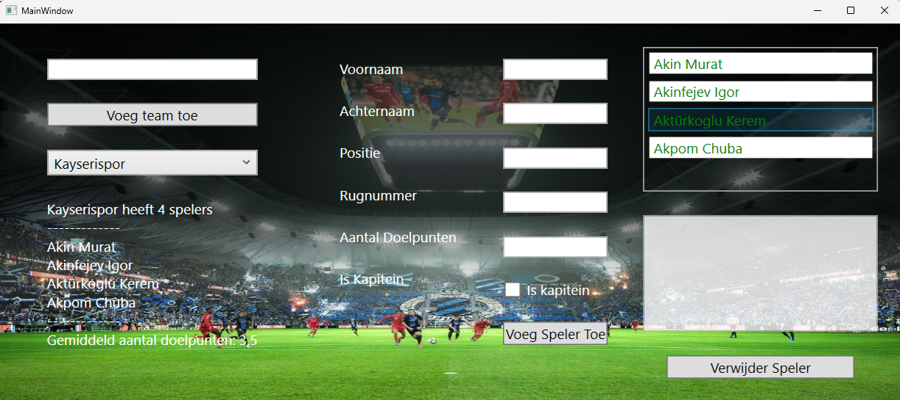
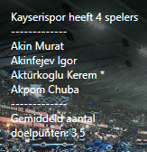
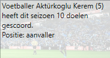
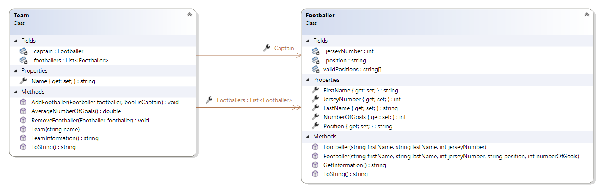

# Classes-7---Voetbal-Manager

## Applicatie layout:

**Voetbalteam Management App:**
Maak een C#-applicatie voor het beheren van voetbalteams. Het programma moet de volgende functionaliteiten bevatten:

## Klasses
Maak gebruik van een Class Library voor je klasses.

1. Team:
	- Definieer een klasse "Team" met de volgende eigenschappen en variabelen:
		- TeamName: string
		- Captain: Footballer. Deze eigenschap maakt gebruik van een extra controle in de setter. Er wordt gecontroleerd of de Captain ook effectief in het team zit. Zoniet, dan wordt er geen waarde toegewezen.
		- Een lijst met footballers die bij het team horen van het type Footballer. Zorg er voor dat deze lijst readonly is. Achterliggend heb je een variabelen die je aanpast met de methodes AddFootballer en RemoveFootballer.
	- Implementeer de volgende constructor:
		- Team(string name) die de naam van het team initialiseert.
	- Implementeer de volgende methodes:
		- Implementeer een methode, AddFootballer(Footballer footballer, bool isCaptain), om footballers aan het team toe te voegen. Indien de footballer een Captain is, dan wordt de huidige Captain waarde overschreven met de doorgegeven footballer.
		- Implementeer een methode, RemoveFootballer(Footballer footballer), om footballers uit het team te verwijderen
		- Implementeer de methode ToString(), die de naam van het team teruggeeft.
		- Implementeer de methode AverageNumberOfGoals die de gemiddelde hoeveelheid doelpunten berekent voor alle footballers in het team.
		- Implementeer een methode, TeamInformation(), die de teaminformatie weergeeft in het volgende formaat:
		

2. Footballer:
	- Definieer een klasse "Footballer" met de volgende eigenschappen en variabelen:
		- FirstName: string
		- LastName: string
		- Position op het veld (goalkeeper, attacker, midfielder of defender). Pas de setter aan, zodat enkel één van de vier geldige waardes toegewezen kan worden.
		- JerseyNumber: int. Pas de setter van JerseyNumber aan, zodat het rugnummer tussen 0 en 100 moet liggen.
		- NumberOfGoals: int
	- Implementeer de volgende constructors:
		- Voorzie één constructor voor alle parameters.
		- Voorzie een tweede constructor waarin je niet de positie en het aantal doelpunten doorgeeft. De positie en het aantal doelpunten krijgen de standaardwaardes “midfielder” en 0.
	- Implementeer de volgende methodes:
		- Implementeer de ToString methode om de footballer zijn naam weer te geven. Deze geeft het volgende formaat “LastName - FirstName”.
		- Implementeer de methode Informatie die informatie van de Footballer in het volgende formaat teruggeeft.
		

## WPF vereisten:
1. Teams toevoegen:
	- Als gebruiker kan ik een TeamName ingeven in een tekstveld en klikken op de “Voeg team toe”-knop om een nieuw team met een unieke naam aan te maken.
	- Nieuwe teams verschijnen automatisch in de dropdown van teams.
2. Footballer beheer:
	- Als gebruiker kan ik een team selecteren in de team-dropdown en vervolgens verschijnen alle footballers in de ListBox en toont de applicatie de informatie van het team en de eerste footballer.
	- Als gebruiker kan ik teams toevoegen aan het geselecteerde team.
	- Als gebruiker kan ik geselecteerde footballers verwijderen van een team.
3. User Interface:
	- Als gebruiker kan ik een selectie aanpassen in de dropdown of combobox om automatisch de layout te updaten.
	- Als gebruiker wordt ik gewaarschuwd wanneer ik ongeldige informatie gebruik voor een team of footballer toe te voegen.
4. Start situatie:
	- Wanneer de applicatie start, dan is er één team aanwezig. In dit team zijn minstens vier footballers aanwezig.